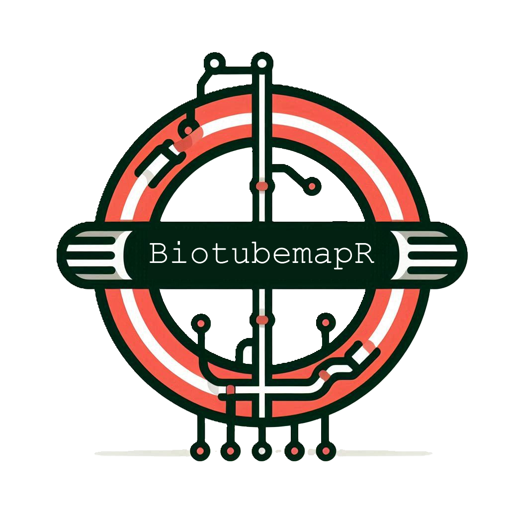

<p align="center">
  
</p>

# biotubemapR

`biotubemapR` is an R package designed to visualize and explore biological networks, drawing inspiration from the iconic layout of underground maps. It offers intuitive graph layouts that organize proteins, receptors, transcription factors, and other molecular entities in a structured and visually appealing manner. The package leverages powerful graph algorithms and layouts, enabling researchers to understand complex signaling pathways and molecular interactions in a user-friendly format.

Whether you're looking to visualize protein interactions, receptor signaling cascades, or transcriptional regulation, `biotubemapR` provides a versatile toolkit for making sense of biological networks with clarity and precision.

## Key Features

- **Custom Pathway Layouts**: Organize nodes in a biologically meaningful way, based on their roles (e.g., receptors, transcription factors).
- **Clear Visualizations**: Generate publication-quality network plots with customizable colors and layout options.
- **Flexible Node Classification**: Automatically classify nodes as receptors, transcription factors, or other categories using built-in functions.
- **Flow-Based Subgraph Extraction**: Filter and visualize subgraphs based on flow thresholds to highlight key network components.
- **Inspired by London Underground Maps**: Network layouts are inspired by the clarity and structure of underground transport maps, making complex data easy to navigate.

## Installation

You can install the latest version of `biotubemapR` from GitHub using the `devtools` package:

```r
# Install devtools if you haven't already
install.packages("devtools")

# Install biotubemapR from GitHub
devtools::install_github("CharlieBarker/biotubemapR")
# biotubemapR
