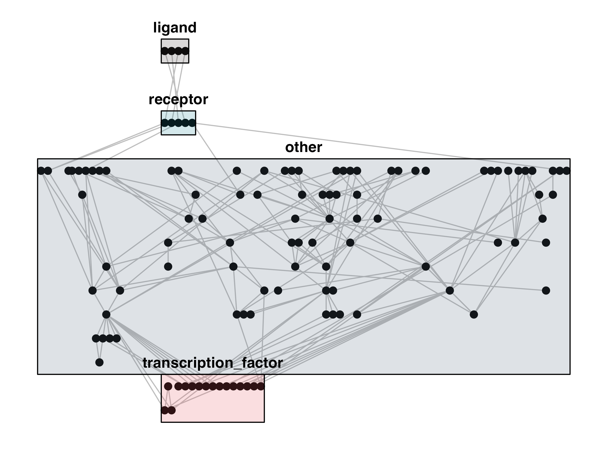

<p align="center">
  
</p>

# biotubemapR

`biotubemapR` is an R package designed to visualize and explore biological networks, drawing inspiration from the iconic layout of underground maps. It offers intuitive graph layouts that organize proteins, receptors, transcription factors, and other molecular entities in a structured and visually appealing manner. The package leverages powerful graph algorithms and layouts, enabling researchers to understand complex signaling pathways and molecular interactions in a user-friendly format.

Whether you're looking to visualize protein interactions, receptor signaling cascades, or transcriptional regulation, `biotubemapR` provides a versatile toolkit for making sense of biological networks with clarity and precision.

## Key Features

- **Custom Pathway Layouts**: Organize nodes in a biologically meaningful way, based on their roles (e.g., receptors, transcription factors).
- **Clear Visualizations**: Generate publication-quality network plots with customizable colors and layout options.
- **Flexible Node Classification**: Automatically classify nodes as receptors, transcription factors, or other categories using built-in functions.
- **Flow-Based Subgraph Extraction**: Filter and visualize subgraphs based on flow thresholds to highlight key network components.
- **Inspired by London Underground Maps**: Network layouts are inspired by the clarity and structure of underground transport maps, making complex data easy to navigate.

## Installation

You can install the latest version of `biotubemapR` from GitHub using the `devtools` package:

```r
# Install devtools if you haven't already
install.packages("devtools")

# Install biotubemapR from GitHub
devtools::install_github("CharlieBarker/biotubemapR")
```

## Custom Pathway Layouts

Organize nodes in a biologically meaningful way, based on their roles (e.g., receptors, transcription factors).

Load packages: 
```r
library(BMAlayout) #for extracting kegg graphd
library(biotubemapR)
library(tidyverse)
library(igraph)
library(jsonlite)
library(ggraph)
library(ghibli) #for palettes 

```
Use pathwayLayout function on graph to classify nodes and organise as layers 
```r
# xmls can be downloaded from kegg website
g <- kegg_to_igraph("./hsa04010.xml")

pLayout <- pathwayLayout(g, transcription_factor_y_position = -3)
```

Plot graph using the bounds of the layers to visualise
```r

# Get node types and coordinates
node_types <- pLayout$node_types
layout_matrix <- pLayout$layout_matrix

# Create a data frame that combines node types and layout coordinates
node_data <- as.data.frame(layout_matrix) %>%
  mutate(name = rownames(layout_matrix)) %>%
  left_join(node_types, by = c("name" = "name"))

# Calculate bounding boxes for each node type
bounding_boxes <- node_data %>%
  group_by(type) %>%
  summarise(
    xmin = min(x) - 0.5,
    xmax = max(x) + 0.5,
    ymin = min(y) - 0.5,
    ymax = max(y) + 0.5
  )

# Plot the network
ggraph(g, layout = layout_matrix) +
  geom_edge_link(color = "gray") +
  geom_node_point(size = 3) +  # Color nodes by type
  # Add bounding boxes
  geom_rect(data = bounding_boxes, aes(xmin = xmin, xmax = xmax, ymin = ymin, ymax = ymax, fill = type),
            color = "black", alpha = 0.2) +
  # Apply Ghibli color palette to the fill aesthetic
  scale_fill_ghibli_d("PonyoMedium") +
  # Add labels for each node type
  geom_text(data = bounding_boxes, aes(x = (xmin + xmax) / 2, y = ymax + 0.5, label = type),
            size = 5, fontface = "bold") +
  cowplot::theme_cowplot()+
  theme(
    legend.position = "none",  # Hide the legend
    axis.line = element_blank(),  # Remove axis lines
    axis.text = element_blank(),  # Remove axis text (tick labels)
    axis.ticks = element_blank(), # Remove axis ticks
    axis.title = element_blank()  # Remove axis titles
  )
```

output :

<p align="center">
  
</p>

tube data taken from https://github.com/nicola/tubemaps/tree/master
